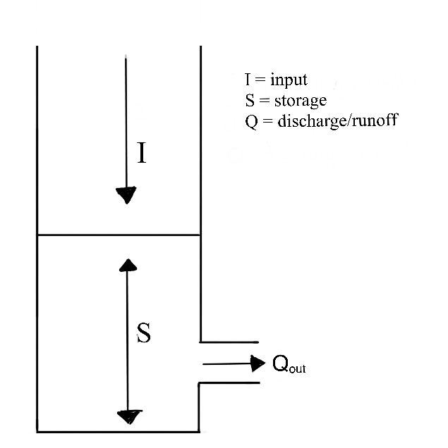
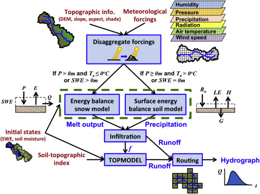
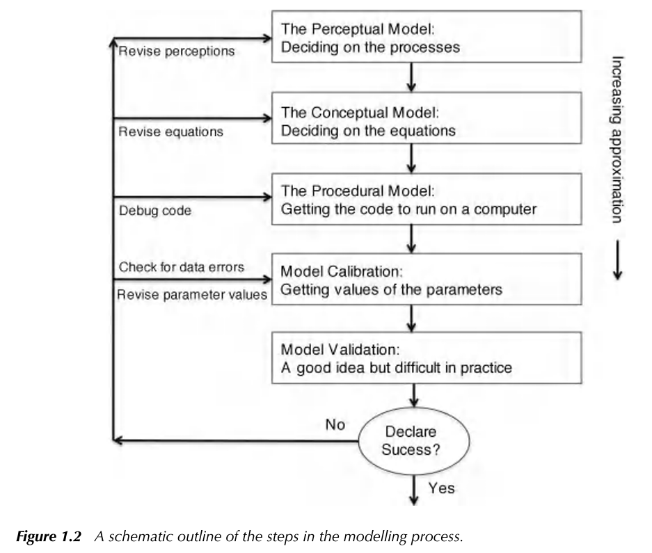

# Part 3: Bucket and Process-Based Models

## Classifying model structure
### Learning Module

Throughout the rest of the course, we will gather data and create models to explore how environmental factors, such as snowmelt, land cover, and topography, impact runoff. To discuss these methods, we should review some modeling terminology describing model complexity and type.

Environmental models, including hydrological models, are built around simplifying assumptions of natural systems. The complexity of the model may depend on its application. Effective hydrological models share key traits: they are simple, parsimonious, and robust across various watersheds. In other words, they are easy to understand and streamlined and consistently perform well across different basins or even geographical areas. Therefore, more complex is only sometimes better. 

#### Spatial Complexity

There are general terms that classify the spatial complexity of hydrological models:

A **lumped** system is one in which the dependent variables of interest are a function of time alone, and the study basin is spatially 'lumped' or assumed to be spatially homogeneous across the basin. So far in this course, we have focused mainly on lumped models. You may remember the figure below from the transfer functions module. It represents the lumped watershed as a bucket with a single input, outlet output, and storage volume for each timestep.

```{r, echo=FALSE, out.width='35%', fig.align='center'}

```

A **distributed** system is one in which all dependent variables are functions of time and one or more spatial variables. Modeling a distributed system means partitioning our basins into raster cells (grids) and assigning inputs, outputs, and the spatial variables that affect inputs and outputs across these cells. We then calculate the processes at the cell level and route them downstream. These models allow us to represent the spatial complexity of physically based processes. They can simulate or forecast parameters other than streamflow, such as soil moisture, evapotranspiration, and groundwater recharge. 

A **semi-distributed** system is an intermediate approach that combines elements of both lumped and distributed systems. Certain variables may be spatially distributed, while others are treated as lumped. Alternatively, we can divide the watershed into sub-basins and treat each sub-basin as a lumped basin. Outputs from each sub-basin are then linked together and routed downstream. Semi-distribution allows for a more nuanced representation of the basin's characteristics, acknowledging spatial variability where needed while maintaining some simplifications for computation efficiency.  

```{r, echo=FALSE, out.width='80%', fig.align='center'}
knitr::include_graphics("images/lumpd_dist_ws.png")
```

In small-scale studies, we can design a model structure that fits the specific situation well. However, when we are dealing with larger areas, model design may be challenging. Our data might differ across regions with variable climate and landscape features. Sometimes, it is best to use a complex model to capture all the different processes happening over a big area. However, it could be better to stick with a simpler model because we might have limited data or the number of calculations is very computationally expensive. It is up to the modeler to determine the simplest model that meets the desired application. 

#### Modeling Approaches

**Empirical Models** are based on empirical analysis of observed inputs (e.g., rainfall) or outputs (ET, discharge). These simple models may not be transferable to other watersheds. Also, they may not reveal much about the physical processes influencing runoff. Therefore, these types of models may not be valid if the study area experiences land use or climate change. 

**Conceptual Models** describe processes with simple mathematical equations. For example, we might use a simple linear equation to interpolate precipitation inputs over a watershed with a high elevation gradient using precipitation measurements from two points (high and low). This represents the basic relationship between precipitation and elevation, but does not capture all features that affect precipitation patterns (e.g. aspect, prevailing winds). The combined impact of these factors is probably negligible compared to the substantial amount of data required to accurately model them.

**Physically Based Models ** These models offer deep insights into the processes governing runoff generation by relying on fundamental physical equations like mass conservation. However, they come with drawbacks. Their implementation often demands complex numerical solving methods and a significant volume of input data. Without empirical data to validate these techniques, there is a risk of introducing substantial uncertainty into our models, reducing their reliability and effectiveness.

An example of a spatial distributed and physically based watershed model(Huning and Marguilis, 2015):
```{r, echo=FALSE, out.width='80%', fig.align='center'}

```

When modeling watersheds, we often use a mix of empirical, conceptual, and physically based models. The choice of model type depends on factors like the data we have, the time or computing resources we can allocate, and how we plan to use the model.

These categorizations provide a philosophical foundation of how we understand and simulate systems. However we can also consider classifications that focus on the quantitative tools and techniques we use to implement these approaches. Consider that we have already applied each of these tools:

**Probability Models ** Many environmental processes can be thought of or modeled as stochastic, meaning a variable may take on any value within a specified range or set of values with a certain probability. Probability can be thought of in terms of the relative frequency of an event. We utilized probability models in the return intervals module where we observed precipitation data, and used that data to develop probability distributions to estimate likely outcomes for runoff. Probability models allow us to quantify risk and variability in systems.

**Regression Models ** Often we are interested in modeling processes with limited data, or processes that aren't well understood. Regression assumes that there is a relationship between dependent and independent variables (you may also see modelers call these explanatory and response variables). We utilized regression methods in the hydrograph separation module to consider process-based mechanisms that differed among watersheds. 

**Simulation Models** Simulation models can simulate time series of hydrologic variables (as in the following snow melt module), or they can simulate characteristics of the modeled system, as we saw in the Monte Carlo module. These types of models are based on an assumption of what the significant variables are, an understanding of the important processes are, and/or a derivation of these physical processes from first principles (mass, energy balance).

#### A priori model selection: 
By understanding the different frameworks of environmental modeling, we can choose the right tools for the right context, depending on our data, goals and resources. In reality, the final model selection is a fluid process requiring multiple iterations at each step. 
In Keith Beven's Rainfall-Runoff Modelling Primer, they illustrate the process as: 

```{r, echo=FALSE, out.width='80%', fig.align='center'}

```

While we aim to give some hands on experience across multiple model types, there is a wide range of possible models! Why would the most complex model, or one that represents the most elements in a system be best? Why even consider a simple bucket model?

Many modelers have observed that the number of parameters required to describe a key behavior in a watershed is often quite low, meaning increasing the number of parameter does not result in a significantly improved model. This idea that simple models are often sufficient fo representing a system have led to the investigation of **parsimonious** model structures (less complex).Consider though, that the model must sufficiently represent processes or it will be too unreliable outside of the range of conditions on which it was calibrated. 

Now that we have reviewed some concepts, let's move forward into a time series simulation with snowmelt models.  