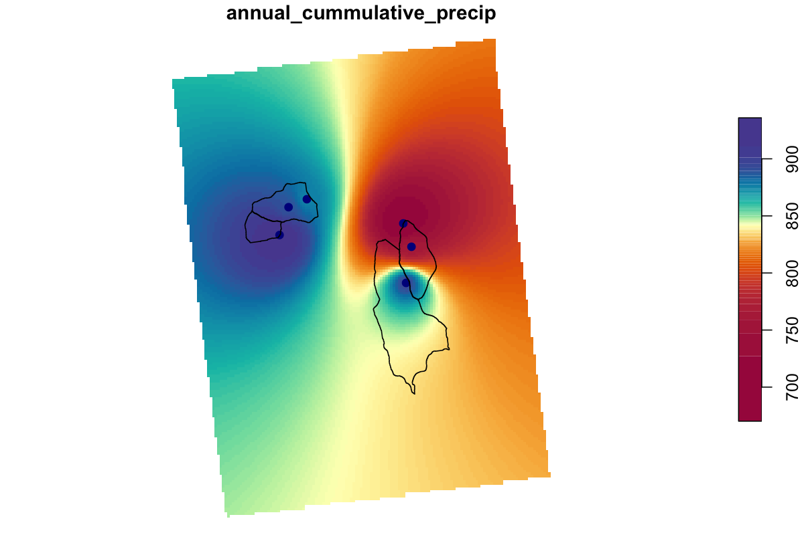

## HBV Hydrology Model

### Learning Module 9
Adapted from Fabian Nippgen (REWM 4500 5500)

#### Background:

```{r, include=FALSE}
# knitr::opts_chunk$set(echo = TRUE)
# 
# #Load packages
# # pkgTest is a helper function to load packages and install packages only when they are not installed yet.
# 
# pkgTest <- function(x)
# {
#   if (x %in% rownames(installed.packages()) == FALSE) {
#     install.packages(x, dependencies= TRUE)
#   }
#   library(x, character.only = TRUE)
# }
# neededPackages <- c("tidyverse", "lubridate", "broom", "TUWmodel", "plotly") 
# 
# for (package in neededPackages){pkgTest(package)}
```

In this exercise, we will pull together many aspects of what we have learned so far to calibrate the HBV model to weighted data from the Fraser Experimental Forest in Colorado using precipitation/runoff and potential evapotranspiration (PET) data derived from the methods explored in the snowmelt and evapotranspiration modules. 

HBV is:
In the previous labs, we have worked with single-process models. HBV is more complex process-based model using many parameters to describe the physical processes of the hydrologic cycle
https://rpubs.com/sdhakal/848236


Reproduced from: Durga Lal Shrestha & Dimitri P. Solomatine (2008) Data‐driven approaches for estimating uncertainty in rainfall‐runoff modelling, International Journal of River Basin Management, 6:2, 109-122, DOI: 10.1080/15715124.2008.9635341

HBV versions with a GUI exists, but the data manipulation is more convenient in a coding environment, and we want you to be able to see 'under the hood'. Instead of dealing with the inner workings of the model too much, we will put the focus on importing and organizing the data, getting the model running and manual optimization.  

The HBV realization we will be using is contained in the R package TUWmodel. Please search that package in your browser and familiarize yourself with it (that will be the first step). TUW simply means "Technische Universitaet Wien", or Vienna University of Technology. The model is slightly different from the original HBV but still similar enough to call it HBV. We also need to understand the arguments and parameters required for the model. 

Type '?TUWmodel' in your console. Note that the package comes with an example dataset, and you can run examples either by copying and pasting the data(), TUWmodel() and plots into your console, or you can find and click 'Run examples' under the **Examples** header and view the script and plot outputs in the Help window. The first example shows how the  'TUWmodel' can be run given specifications for a long set of parameters (param). You can provide the model with precip, air temperature, area and ET along with the parameter set and it will simulate SWE, snow melt and discharge. We can obtain measurements for each of these variables, so we will import all of this data and test the fit of the simulated data. 

https://cran.r-project.org/web/packages/TUWmodel/TUWmodel.pdf  

#### Import data: 
We will generate a conceptual runoff model starting with: <br>

- RainMeltWeighted_mm --> liquid input to the ground, combination of rain and melt <br>

- PWeighted_mm --> Precipitation measured at the SNOTEL sites, both liquid and frozen. This is NOT water that went into the ground at that point. This is, however, the P input time series for the HBV model. <br>

- SweWeighted_mm --> Snow water equivalent at the SNOTEL sites. We can use this to evaluate our snow routine. <br>

- TempWeighted --> Either daily mean, min, or max. We will use the mean. <br>

- Discharge_mm --> Q observed at the outlet. <br>

- ET --> Potential Evapotranspiration calculated using relative humidity and temperature. <br>

### Repo link
[Download the repo for this lab HERE](https://github.com/lekokremer/lres546_HBV_repo){target="_blank"}

### Labwork (20 pnts)

Our first steps will be to import and format the data. As you might recall from the previous modules, this step can require the most script and 'work', but is critical to a valid model output. In this assignment, we have simplified much of the data collection for you, as the steps are ones you have already completed in previous modules. 

In the .csv imported below, we started by collecting the same SNOTEL data that you used in the snow melt module, but downloaded for a greater date range (water years 2018-2022) (date, SWE depth in mm, and daily precipitation (mm)) However, you will notice that the column names of the provided table contain 'weighted_'. 

```{r}
# Import model data 
# indata <- read.csv("weighted_data_fool_HBV.csv")%>%
#   mutate(date = ymd(date)) %>%
#   rename(Q_m3_s = m3_s, Q_mm_day = mm_day, runoff_input.mm = input.mm )
# 
# str(indata)
```

As we noted in the Snowmelt module, factors such as elevation and vegetation will affect the of snow-to-runoff rate. Similarly, temperature and precipitation differ with elevation, meaning that SNOTEL data from a single location may not fully represent conditions across the entire watershed.

To account for these variations, the "weighted" values for this exercise have been adjusted using linear scaling relationships that estimate average conditions across the watershed. The adjustments use elevation-precipitation and elevation-temperature relationships derived from inverse distance weighting to better approximate spatially distributed hydrological inputs rather than relying on a single point measurement.



If you are interested, you can start exploring spatial interpolation with: <br>
1. Thiessen polygons

<br>
2. Inverse distance weighting <br>
3. Kringing methods
to determine if any of these are applicable to your study area.

Other columns in our imported data set include:
**Q_m3_s and Q_mm_day** - Discharge (Q) collected at the Fool Creek outlet by USFS, in units of cubic meters per second and mm per day from April until October.
**Tmax_c, Tmin_c and Tmean_c** - Typically, we could find daily mean, max and minimum temperatures in the SNOTEL datasets, however, this particular station is missing temperature data (due to restrictions on technical access in 2020), so we retrieved temperature data from GridMET through [Climate Engine](https://app.climateengine.org/climateEngine). This highlights the importance of evaluating each variable for completeness. It will save you the headache of running the entire workflow, only to find that model outputs cannot be simulated for the later half of 2020 due to missing input data.
**RHmin, RHmax** - Relative humidity daily min and max, also from GridMET, accessed through Climate Engine
**SWEdiff.mm, Pdiff.mm and runoff_input.mm** - all daily outputs of a temperature based snowmelt model (the same as in the snow melt module). runoff_input is the estimated daily input to the stream from melted snow and liquid precipitation combined.

Keep in mind that you can plot more than two variables in a single plot, but they will be most helpful if you group variables with a similar y-scale. For example, cumulative precipitation or SWE values will have a different range than variables that represent daily measurements like 'input_mm'. Alternatively, you can add a secondary y-axis to your plot.

```{r}
# ggplot(data = indata) +
#   geom_point(aes(x = date, y = runoff_input.mm, color = "runoff_input.mm"), size = 0.5) +  # Assign a label for legend
#   geom_point(aes(x = date, y = Q_mm_day, color = "mm/day"), size = 0.5) +  # Assign a different label
#   geom_point(aes(x = date, y = weighted_precip.mm, color = "weighted_precip.mm"), size = 0.5) +  # Assign a different label
#   geom_point(aes(x = date, y = Pdiff.mm, color = "Pdiff.mm"), size = 0.5) +
#   scale_color_manual(values = c("runoff_input.mm" = "blue", "mm/day" = "red", "weighted_precip.mm" = "green", "Pdiff.mm" = 'purple')) +  # Customize colors
#   labs(color = "Discharge Units") +  # Legend title
#   theme_minimal()
```

 2,930m.
watershed_area_m2 <- 2640000 

Note that while the stream is snow-covered, there are no stage/flow measurements being made at this site. For many of our calculations to work, we will not want NA in our data frames. In this data set, if we view the tabular data, the end discharge reading (Q_mm_day), is very similar to the first in the following calendar year. For this example, we will then fill the NA values with the mean of the final and first readings for each winter (Oct - April) NA string.

```{r}
# Rather than scrolling through a dataframe, this gives us a sum of 'NA' ros in this column
# sum(is.na(indata$Q_mm_day))
```

```{r}
# # Function to fill NA values in Q_mm_day during winter (Oct - Apr)
# fill_na_winter <- function(df) {
#   df <- df %>%
#     arrange(date) %>% # Ensure data is sorted
#     mutate(
#       month = month(date),
#       is_winter = month %in% c(10, 11, 12, 1, 2, 3, 4) # Identify winter months
#     )
#   
#   # Identify NA stretches in winter months
#   na_indices <- which(is.na(df$Q_mm_day) & df$is_winter)
#   
#   for (idx in na_indices) {
#     # Find the last non-NA before the current NA
#     prev_value <- df$Q_mm_day[max(which(!is.na(df$Q_mm_day[1:(idx - 1)])))]
#     
#     # Find the next non-NA after the current NA
#     next_value <- df$Q_mm_day[min(which(!is.na(df$Q_mm_day[(idx + 1):nrow(df)])) + idx)]
#     
#     # Replace the NA with the average of prev_value and next_value
#     if (!is.na(prev_value) & !is.na(next_value)) {
#       df$Q_mm_day[idx] <- (prev_value + next_value) / 2
#     }
#   }
#   
#   return(df)
# }
# 
# # Apply the function
# indata <- fill_na_winter(indata)
```

Let's try our quick check again: 

```{r}
# Now we should see zero NA in this column
# sum(is.na(indata$Q_mm_day))
```

Next, we need to add daily potential evapotranspiration (PET) to the dataset. The evapotranspiration module covered some of the numerous pre-built functions available in various R packages designed for ET estimation. For instance, the 'Evapotranspiration' package provides ET estimates derived from approximately 20 distinct equations or variations. These functions require precise data formatting to ensure compatibility with the function arguments. To help you structure your function inputs similarly, many packages come with example datasets in their documentation. SPEI is another package that offers ET functions. The github repository for this package has been updated fairly recently, which can be important to verify. 

We chose to write our own function here so you could 'see under the hood'.  
Not all packages are equally maintained, as they are often developed by researchers or modelers to improve the repeatably of their work, and contribute to the broader scientific community. Once funding ceases, or if the original developer moves on to new projects, a custom package may no longer receive updates or support. As R, RStudio and other supporting packages are updated, a package may become depreciated. If the package still functions correctly in your current R version and dependencies, there’s no immediate reason to stop using it. However, if you are concerned that future versions of R or dependencies might break the packages you use, you can check the development and maintenance history of custom or specialized packages (or write a package or function for yourself as exemplified below!).

Here is our Hargreaves function, adapted from the 'Evapotranspiration' package to minimize re-formatting of our dataframe. 

```{r}

# # Function to calculate ET
# calculate_ET <- function(data, constants, ts = "daily", message = "yes", save.csv = "no", ...) {
#   
#   # Check for required data
#   if (is.null(data$Tmax) | is.null(data$Tmin)) {
#     stop("Required data missing for 'Tmax' and 'Tmin', or 'Temp'")
#   }
#   
#   # Hargreaves-Samani ET Calculation
#   Ta <- (data$Tmax + data$Tmin) / 2
#   P <- 101.3 * ((293 - 0.0065 * constants$Elev) / 293) ^ 5.26
#   delta <- 4098 * (0.6108 * exp((17.27 * Ta) / (Ta + 237.3))) / ((Ta + 237.3) ^ 2)
#   gamma <- 0.00163 * P / constants$lambda
#   d_r2 <- 1 + 0.033 * cos(2 * pi / 365 * data$J)
#   delta2 <- 0.409 * sin(2 * pi / 365 * data$J - 1.39)
#   w_s <- acos(-tan(constants$lat_rad) * tan(delta2))
#   N <- 24 / pi * w_s
#   R_a <- (1440 / pi) * d_r2 * constants$Gsc * (w_s * sin(constants$lat_rad) * sin(delta2) + 
#                                                cos(constants$lat_rad) * cos(delta2) * sin(w_s))
#   C_HS <- 0.00185 * (data$Tmax - data$Tmin) ^ 2 - 0.0433 * (data$Tmax - data$Tmin) + 0.4023
#   ET_HS.Daily <- 0.0135 * C_HS * R_a / constants$lambda * (data$Tmax - 
#                                                               data$Tmin) ^ 0.5 * (Ta + 17.8)
#   ET.Daily <- ET_HS.Daily
#   
#   # Create YearMonth Column
#   data$YearMonth <- as.Date(paste(year(data$Date.daily), month(data$Date.daily), "01", sep = "-"))
#   
#   # Annual and Monthly Aggregations
#   ET.Annual <- aggregate(ET.Daily ~ year(YearMonth), data = data, FUN = sum)
#   ET.Monthly <- aggregate(ET.Daily ~ YearMonth, data = data, FUN = sum)
#   
#   # ET formulating
#   ET_formulation <- "Hargreaves-Samani"
#   ET_type <- "Reference Crop ET"
#   results <- list(ET.Daily = ET.Daily, ET.Monthly = ET.Monthly, 
#                   ET.Annual = ET.Annual, ET_formulation = ET_formulation, 
#                   ET_type = ET_type)
#   
#   # Save to CSV if required
#   if (save.csv == "yes") {
#     for (i in 1:length(results)) {
#       namer <- names(results[i])
#       write.table(as.character(namer), file = "ET_HargreavesSamani.csv", 
#                   dec = ".", quote = FALSE, col.names = FALSE, 
#                   row.names = F, append = TRUE, sep = ",")
#       write.table(data.frame(get(namer, results)), file = "ET_HargreavesSamani.csv", 
#                   col.names = F, append = TRUE, sep = ",")
#     }
#     invisible(results)
#   } else {
#     return(results)
#   }
# }
```

Now we will format the inputs so the data is easily read by the function, and run the function.

```{r}
# # Format our data to fit the function
# PET_data <- list(
#   Tmax = indata$Tmax,
#   Tmin = indata$Tmin,
#   J = as.numeric(format(indata$date, "%j")),
#   Date.daily = indata$date
# )
# 
# # Define constants
# constants <- list(
#   Elev = 2900,                            # Elevation in meters
#   lambda = 2.45,                          # Latent heat of vaporization in MJ.kg^-1
#   lat_rad = 39.88 * pi / 180,             # Latitude in radians
#   Gsc = 0.0820                            # Solar constant in MJ.m^-2.min^-1
# )
# 
# PET_Hargreaves <- calculate_ET(
#   data = PET_data,
#   constants = constants,
#   ts = "daily",        # Optional; defaults to "daily"
#   message = "yes",     # Optional; prints summary 
#   save.csv = "no"      # Optional; do not save results to a CSV
# )
```

Now we'll add daily ET into our original dataframe:

```{r}
# PET_mm <- PET_Hargreaves$ET.Daily
# # put the approximated PET_mm into the larger indata df
# indata <- cbind(indata, PET_mm)  #with cbind
# 
# head(indata)
```


```{r}
# # Annual summary stats
# indata_analysis <- indata %>%
#   select(-date) %>%
#   group_by(wtr_yr) %>%
#   summarise(
#     weighted_precip.mm = sum(weighted_precip.mm, na.rm = TRUE),
#     Tmean_c = mean(Tmean_c, na.rm = TRUE),
#     swe.mm_max = max(weighted_swe.mm, na.rm = TRUE),
#     pcumul.mm_max = max(weighted_pcumul.mm, na.rm = TRUE),
#     Tmax = max(Tmax_c, na.rm = TRUE),
#     Tmin = min(Tmin_c, na.rm = TRUE),
#     Q_mm_sum = sum(Q_mm_day, na.rm = TRUE),
#     PET_mm_sum = sum(PET_mm, na.rm = TRUE), 
#     runoff_input.mm = sum(runoff_input.mm, na.rm = TRUE),
#   )
# 
# indata_analysis

```


```{r}
# # Your script below should fit your variables from your summary dataframe above. Here is an example of what a simple water balance might look like if I named my summary dataframe indata_analysis: 
# 
# # Calculate the residual water after accounting for PET and discharge
# residual_water <- indata_analysis$runoff_input.mm - (indata_analysis$PET_mm_sum + indata_analysis$Q_mm_sum)
# 
# # View the residual for each year
# print(residual_water)
```
By subtracting discharge and PET from runoff_input, we’re essentially examining the residual water. This could represent the amount of water available to the system after accounting for the demand (PET) and the outflow (discharge).

```{r}
# # make long form with PETsum and Psum as the key-value pairs (exclude wtr_yr from )
# dat_sum_plot <- indata_analysis %>%
#   pivot_longer(names_to =  "key", values_to =  "value", -wtr_yr)
# 
# # bar plot pf PET and P for each year
# ggplot(dat_sum_plot, aes(x = wtr_yr, y = value, fill = key)) +
#   geom_bar(stat = "identity", position = "dodge") +
#   labs(x = "Water Year", y = "mm/year", fill = {})
```

```{r}
# ### TIMING
# # create weekly means or totals for both time series and plot them together to determine the timing of each 
# dat_weekly <- indata %>%
#   group_by(Week = week(date)) %>%
#   summarise(
#     PET = sum(PET_mm), 
#     P = sum(runoff_input.mm)
#     ) %>%
#     pivot_longer(names_to = "key", values_to = "value", -Week)
# 
# # line plot of P and PET on a weekly basis. Use dat_weekly as the data source.
# ggplot(dat_weekly, aes(x = Week, y = value, color = key)) +
#   geom_line() + # create line plot
#   labs(x = "Week of Year", y = "mm/year", color = {})
```

#### Single model run
Look at the parameters to make sure you know what each parameter does. The way the model is set up, is that everything is hidden inside a function. The user (--> you) only formats the input data and passes the parameters to the function. All model output is contained in "modelRun". If you look at the Environment, you will notice that modelRun is a list. A list is even more flexible in terms of data storage than a dataframe (a dataframe is actually a special type of list...). While lists are super flexible, they can also be more cumbersome to deal with. I included some code that takes the output from the model run and saves all the important bits and pieces in a convenient dataframe called HBVRun. For this part (single model runs), you will really only need the data contained in the HBVRun dataframe.
  
#### single model execution
```{r}
# # set up the parameter vector
# model_params <- c(
#   1.05, # SCF snow correction factor [-] (e.g., 0.9-1.5);
#   1.80, # DDF degree day factor [mm/degC/timestep] (e.g., 0.0-5.0 mm/degC/day);
#   2, # Tr threshold temperature above which precipitation is rain [degC] (e.g., 1.0-3.0 degC);
#   0, # Ts threshold temperature below which precipitation is snow [degC] (e.g., -3.0-1.0 degC);
#   -0.336, # Tm threshold temperature above which melt starts [degC] (e.g., -2.0-2.0 degC);
#   0.2, # LPrat parameter related to the limit for potential evaporation [-] (e.g., 0.0-1.0);
#   121, # FC field capacity, i.e., max soil moisture storage [mm] (e.g., 0-600 mm);
#   2.52, # BETA the non linear parameter for runoff production [-] (e.g., 0.0-20.0);
#   0.473, # k0 storage coefficient for very fast response [timestep] (e.g., 0.0-2.0 days);
#   9.06, # k1 storage coefficient for fast response [timestep] (e.g., 2.0-30.0 days);
#   142, # k2 storage coefficient for slow response [timestep] (e.g., 30.0-250.0 days);
#   50.1, # lsuz threshold storage state, i.e., the very fast response start if exceeded [mm] (e.g., 1.0-100.0 mm);
#   2.38, # cperc constant percolation rate [mm/timestep] (e.g., 0.0-8.0 mm/day);
#   10, # bmax maximum base at low flows [timestep] (e.g., 0.0-30.0 days);
#   25 # croute free scaling parameter [timestep^2/mm] (e.g., 0.0-50.0 days^2/mm);
# )
# 
# 
# # set time period
# model_in <- indata %>%
#   filter(date >= as_date("2017-10-01") & date <= as_date("2022-09-30"))
# 
# # set up the model
# ## THIS IS THE ACTUAL MODEL EXECUTION
# modelRun <- TUWmodel(
#   prec = model_in$weighted_precip.mm, # precip input
#   airt = model_in$Tmean_c, # air temp input
#   ep = model_in$PET_mm, # pet input
#   area = 1, # one zone for the entire watershed
#   param = model_params # input model parameters
# )
# 
# 
# # get all outputs into a nice df
# HBVRun <- tibble(
#   Date = model_in$Date, # date
#   P_mm = modelRun$prec, # precip
#   Tair = modelRun$airt, # air temp
#   SWEobs = model_in$weighted_swe.mm, # observed swe
#   PET = modelRun$ep,# pet
#   Qobs = model_in$Q_mm_day, # observed discharge
#   Qsim = modelRun$q[1, ], # simulated discharge
#   Qsurf = modelRun$q0[1, ], # surface runoff
#   Qsubsurf = modelRun$q1[1, ], # subsurface flow
#   Qbase = modelRun$q2[1, ], # groundwater flow
#   Rain = modelRun$rain[1, ], # simulated rain
#   Snow = modelRun$snow[1, ], # simulated snowfall
#   Melt = modelRun$melt[1, ], # simulated melt
#   SWEsim = modelRun$swe[1, ], # simulated swe
#   Soilmoist = modelRun$moist[1, ], # simulated soil storage
#   AET = modelRun$eta[1, ], # simulated evapotranspiration
#   StorageUpper = modelRun$suz[1, ], # upper storage value
#   StorageLower = modelRun$slz[1, ] # lower storage value
# )
```

####  Objective functions
##### KGE

Before we can start trying to tune our model to look more like the
observed discharge record, it would be helpful to have some sort of
quantified metric for how well our modeled data fits the measured data.

There are many different ways to do this, but discussion of the pros and cons of those approaches is beyond this quick introduction to modeling.

Here we will demonstrate the Kling-Gupta efficiency both for runoff as well as for swe.
```{r}
# # select the Qobs and Qsim timeseries
# # DON'T FORGET TO EXCLUDE THE FIRST YEAR
# Qobs <- HBVRun$Qobs[366:length(HBVRun$Qobs)] # observed runoff WITHOUT WARM-UP PERIOD
# Qsim <- HBVRun$Qsim[366:length(HBVRun$Qsim)] # simulated runoff WITHOUT WARM-UP PERIOD
# 
# # KGE
# kge_r_q <- cor(Qobs, Qsim)
# kge_beta_q <- mean(Qsim) / mean(Qobs)
# kge_gamma_q <- (sd(Qsim) / mean(Qsim)) / (sd(Qobs) / mean(Qobs))
# kge_q <- 1 - sqrt((kge_r_q - 1)^2 + (kge_beta_q - 1)^2 + (kge_gamma_q - 1)^2)
# kge_q
```

```{r}
# ## Snow - water equivalent
# SWEobs <- HBVRun$SWEobs[366:length(HBVRun$SWEobs)] # observed swe WITHOUT WARM-UP PERIOD
# SWEsim <- HBVRun$SWEsim[366:length(HBVRun$SWEobs)] # simulated swe WITHOUT WARM-UP PERIOD
# 
# # KGE
# kge_r_swe <- cor(SWEobs, SWEsim)
# kge_beta_swe <- mean(SWEsim) / mean(SWEobs)
# kge_gamma_swe <- (sd(SWEsim) / mean(SWEsim)) / (sd(SWEobs) / mean(SWEobs))
# kge_swe <- 1 - sqrt((kge_r_swe - 1)^2 + (kge_beta_swe - 1)^2 + (kge_gamma_swe - 1)^2)
# kge_swe
```

##### Nash-Sutcliffe Efficiency (NSE).

Basically, the NSE looks at how much better your model run did that if you had just used the mean discharge for the data record as your "modelled results". It does this by comparing how far off the observed values where from the mean discharge to how far off the modeled values were from the observed discharge. -->
Mathematically, NSE is the sum of the squared differences between the modeled and observed discharge divided by the sum of the squared differences between the observed and mean discharge, subtracted by 1. 

$$ NSE = 1 - \frac{\sum_{t = 1}^{T}{(Q_m^t - Q_o^t)^2}}{\sum_{t = 1}^{T}{(Q_o^t - \bar{Q_o})^2}}
$$ 
Where $Q_m^t$ is modeled discharge at time t, $Q_o^t$ is observed

discharge at time t, and $\bar{Q_o}$ is mean observed discharge.

```{r}
# #Calculate NSE for snow, SWE is modeled, STA2 is measured
# NSE_Q <- 1 - ((sum((HBVRun$Qobs - HBVRun$Qsim) ^ 2)) / 
#                  sum((HBVRun$Qsim - mean(HBVRun$Qsim)) ^ 2))
# 
# NSE_Q
```

```{r}
# #Calculate NSE for snow, SWE is modeled, STA2 is measured
# NSEsno <- 1 - ((sum((HBVRun$SWEobs - HBVRun$SWEsim) ^ 2)) / 
#                  sum((HBVRun$SWEsim - mean(HBVRun$SWEsim)) ^ 2))
# 
# NSEsno
```
#### Calibrate HBV manually

Woohoo! We can now run our model and assess how well it is working!

Now, let's see how well we can get it to work. The code below runs the model, produces a plot, and calculates the NSE based on discharge.


```{r}
# #when this term = 1, then triangular routing is invoked, or for no routing, routing = 0
# #if routing = 0 then MAXBAS doesn't do anything
# routing <- 0      
# 
# #hard code parameters 
# params <- c(40,     #FCM ax soil moisture storage, field capacity
#             1,      #beta Shape coefficient governing fate of water input to soil moisture storage
#             0.3,    #LP Threshold for reduction of evap
#             0.4,    #SFCF Snowfall correction factor
#             -1.5,   #TT Threshold temperature
#             1,      #CFMAX Degree-day factor
#             0.05,   #k0 Recession constant (upper storage, near surface)
#             0.01,   #k1 Recession constant (upper storage)
#             0.001,  #k2 Recession constant (lower storage)
#             0,      #UZL Threshold for shallow storage
#             0,      #PERC Percolation, max flow from upper to lower storage
#             1       #MAXBAS base of the triangular routing function, days
#             )
# 
# #Run the model
# Out <- HBV(params, P, Temp, PET, routing)
# 
# #Add observed output
# Out <- bind_cols(Out, Qobs1)
# 
# #Trim out the warm up period
# OutTrim <- filter(Out, DATE >= mdy("01-01-2011"))
# 
# #Calculate NSE
# NSE <- 1 - ((sum((OutTrim$q - OutTrim$WS_3) ^ 2)) / 
#                  sum((OutTrim$WS_3 - mean(OutTrim$WS_3)) ^ 2))
# 
# #Create plot with NSE in title
# OutTrim %>% plot_ly(x = ~DATE) %>% 
#         add_trace(y = ~q, name = 'Modeled',  type = 'scatter', mode = 'lines') %>% 
#         add_trace(y = ~WS_3, name = 'Measured', type = 'scatter', mode = 'lines') %>% 
#         layout(title=paste("NSE: ", round(NSE,2)))
```

#### Plot observed and model simulations

Generate plots that include and compare the different modeled fluxes from your best NSE. Some of those fluxes can be immediately compared to observed data (e.g., runoff or SWE), while others only exist in simulated form (e.g., storages or outflows of the various runoff components) and need to be assessed with the perceptual model in mind.  
Make sure that the axes are properly labeled when you create plots. The script below will get you started. 

```{r}
# # Add date to the HBVRun result tibble
# HBVRun <- as.data.frame(HBVRun)
# HBVRun$Date <- model_in$date
# str(HBVRun)
# 
# # Overall runoff (Qsim and Qobs)
# q_plot <- ggplot(data = HBVRun) +
#   geom_line(aes(x = Date, y = Qobs, color = "Qobs")) + # Qobs
#   geom_line(aes(x = Date, y = Qsim, color = "Qsim")) + # Qsim
#   labs(x = {}, y = "Q (mm/day)", color = {}, title = "Qobs and Qsim")
# ggplotly(q_plot)
```

```{r}
# Swe
# swe_plot <- ggplot(data = HBVRun) +
#   geom_line(aes(x = Date, y = SWEobs, color = "SWEobs")) + # SWEobs
#   geom_line(aes(x = Date, y = SWEsim, color = "SWEsim")) + # SWEsim
#   labs(x = {}, y = "SWE (mm)", color = {})
# ggplotly(swe_plot)
```


```{r}
# q_bucket_plot <- ggplot(data = HBVRun) +
#   geom_line(aes(x = Date, y = Qsurf, color = "Qsurf")) + # Qsurf
#   geom_line(aes(x = Date, y = Qsubsurf, color = "Qsubsurf")) + #Qsubsurf
#   geom_line(aes(x = Date, y = Qbase, color = "Qbase")) + # Qbase
#   labs(x = {}, y = "Q (mm)", color = {}, title = "Q0, Q1, and Q2")
# ggplotly(q_bucket_plot)
```

```{r}
# # PET and AET
# pet_plot <- ggplot(data = HBVRun) +
#   geom_line(aes(x = Date, y = PET, color = "PET")) + # PET
#   geom_line(aes(x = Date, y = AET, color = "AET")) + # AET
#   labs(x = {}, y = "Flux (mm)", color = {}, title = "PET and AET")
# ggplotly(pet_plot)
```

```{r}
# # Storages
# storage_plot <- ggplot(data = HBVRun) +
#   geom_line(aes(x = Date, y = Soilmoist, color = "Soil moisture storage")) + # soil moisture storage
#   geom_line(aes(x = Date, y = StorageUpper, color = "Upper storage")) + # upper storage
#   geom_line(aes(x = Date, y = StorageLower, color = "Lower storage")) + # lower storage
#   labs(x = {}, y = "Storage (mm)", color = {}, title = "Storages")
# ggplotly(storage_plot)
```

