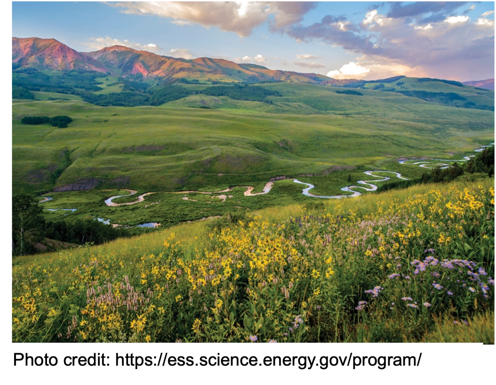

--- 
title: "Quantitative Environmental Methods: LRES 546"
author: Tim Covino & Lauren Kremer
site: bookdown::bookdown_site
---
# Part 1: Foundations of Environmental Modeling
## Introduction

This book provides the materials that we will use in Quantitative Environmental Methods (LRES 546). In this class we will be learning the fundamentals of environmental data analysis and simulation in R. 

Instructor: Dr. Tim Covino\

Time and location: Asynchronous, online\
Office hours: By appointment\
Email: timothy.covino@montana.edu\
TA: Lauren Kremer\
Email: lauren.kremer@montana.edu\

## Course overview and objectives 

(1) provide theoretical understanding and practical experience with common analysis and modeling techniques relevant to watershed hydrology/environmental science. 

(2) provide training in analyzing, simulating, and presenting scientific data in written and oral formats.

## Course Description 

This course will focus on development of quantitative analysis and modeling skills in watershed and environmental science. Students will develop skills necessary to perform quantitative analyses, describe and evaluate model structure, evaluate the merit of different models of varying type and complexity, and use quantitative analyses to address problems in environmental/watershed science. Students will apply computer programming in R to analyze and simulate watershed and/or environmental dynamics spanning simple to complex processes, analyses, and simulations. Technical skills and conceptual understanding will be built through lectures, readings, and hands-on quantitative projects.

Note: If you aren't familiar with R, or don't have coding experience, don't worry. We will walk you through all of the coding. I hope that by the end of this class each student will be a strong quantitative scientist with equally strong coding skills. 

## Structure

This class will utilize hands-on/active learning, and students will be conducting watershed analyses and modeling exercises. We will be doing our analysis and modeling in R and will do some R coding in each class/work session. Programming is best learned by doing it often. Each week there will be recorded videos and/or readings, where we will talk about and work through various types of hydrological analyses. We will then put the content from the recorded lectures to work in a lab where students will complete a variety of hydrological analyses in R. Students can work through material on their schedule, but Dr. Covino and Lauren Kremer (TA) will be available to help with technical coding problems or to answer other questions on weekly labs - just send us an email and we will meet with you. 

## Philosophical approach and resources

This course will use all online and open-source resources and will follow FAIR (findability, accessibility, interoperability, and reusability) data principles and promote sharing of hydrological education and research materials. Our computing will utilize open source [R](https://cran.rstudio.com/){target="_blank"} and [RStudio](https://posit.co/download/rstudio-desktop/){target="_blank"} software. 

Books/resources, we may not use all of these, but they are good references:  
- [R for Data Science](https://r4ds.hadley.nz/){target="_blank"}\
- [Statistical Methods in Water Resources](https://pubs.usgs.gov/tm/04/a03/tm4a3.pdf){target="_blank"} 
- [Tidy modeling with R](https://www.tmwr.org/#hello-world){target="_blank"}\
- [ggplot2: Elegant Graphics for Data Analysis](https://ggplot2-book.org/){target="_blank"}\
- [Advanced R](https://adv-r.hadley.nz/){target="_blank"}\
- [R Packages](https://r-pkgs.org/){target="_blank"} 
- [Environmental Data Science](https://bookdown.org/igisc/EnvDataSci/){target="_blank"}

**Additional readings will be made available on this bookdown page as needed.**
 
## Tentative schedule, subject to change
**Part 1: Foundations of Environmental Modeling**
**Week 1** *1/13 - 1/16*   
- Introduction, overview, and technical skills.\
- If you need a refresher for R please see [Chapters 1, 2, & 3](https://r4ds.hadley.nz/data-visualize){target="_blank"} 1-Welcome, 2-Introduction, & 3-Data visualization in R for Data Science (RDS).

**Week 2** *1/19 - 1/23*  
-R tutorial and refresher

**Part 2: Tabular Models and Time-Series Analysis** 
**Week 3** *1/26 - 1/30*  
- Hydrograph separation.  

**Week 4** *2/2 - 2/6*  
- Frequency analysis  
  
**Week 5** *2/9 - 2/13*  
- Rational and curve number (CN) methods  

**Part 3: Bucket Models** 
**Week 6** *2/16 - 2/20*  
- Transfer function & rainfall-runoff models 
 
**Week 7** *2/23 - 2/27*  
- Monte Carlo (estimating model parameters) and sensitivity analysis 

**Part 4: Model Classification and Application** 
**Week 8** *3/2 - 3/6*  
- Classifying Model Structure (reading only) 
- Term assignment 1 

**Week 9** *3/9 - 3/13*  
- Term assignment 2  

**Week 10** *3/16 - 3/20*  
SPRING BREAK 

**Part 5: Physical Process models** 
**Week 11** *3/23 – 3/27*  
TBD - choose from 
- Snowmelt models  
- Evapotranspiration 
- Precipitation 

**Part 6: Spatial Models and GIS Integration** 
**Week 12** *3/30 - 4/3*  
- Gridded and tabular data retrieval using API integration packages 

**Week 13** *4/6 - 4/10*  
- DEM processing and analysis in Whitebox  

**Week 14** *4/13 - 4/17*  
- Term project work 

**Week 15** *4/20 - 4/24*  
- Term project work  
- Final presentations due April 25  

**Week 16** *4/27 - 5/1*  
- Last week of classes – Peer review final presentations 

